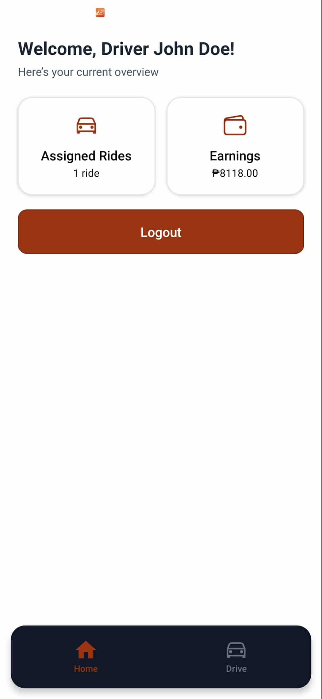
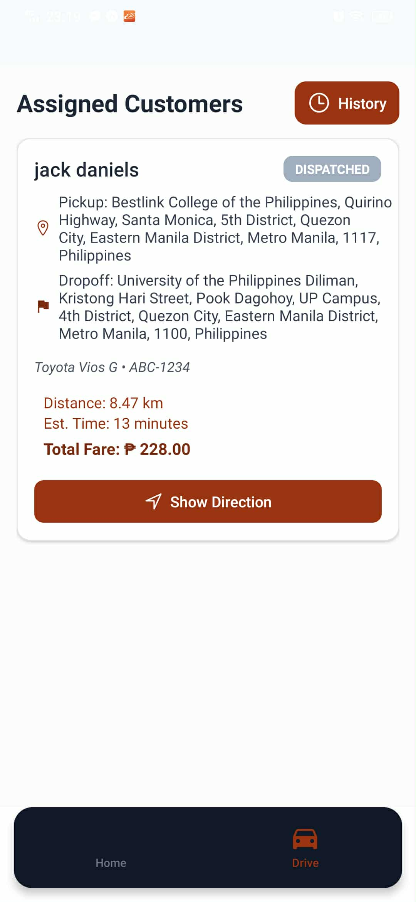
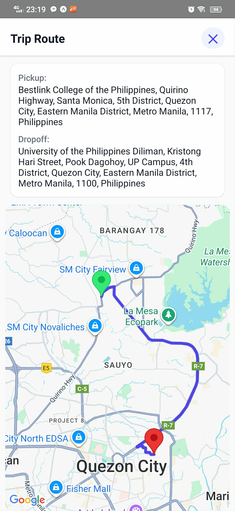
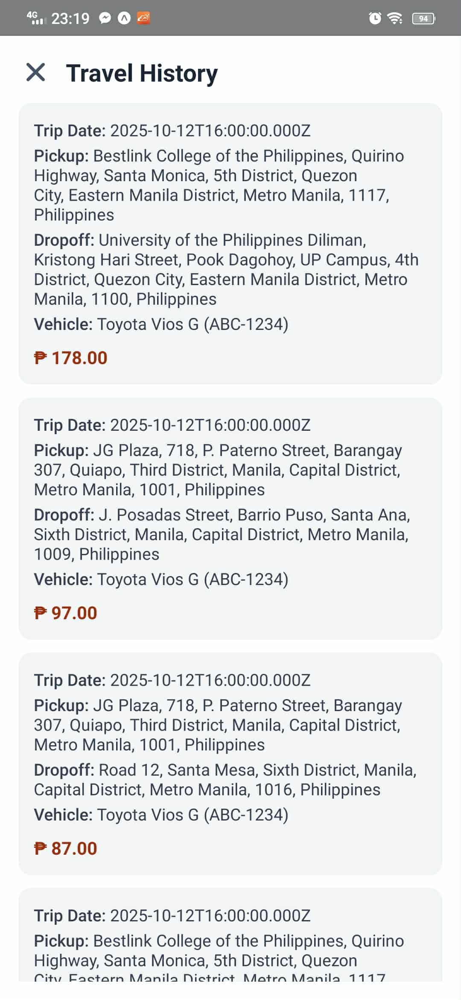
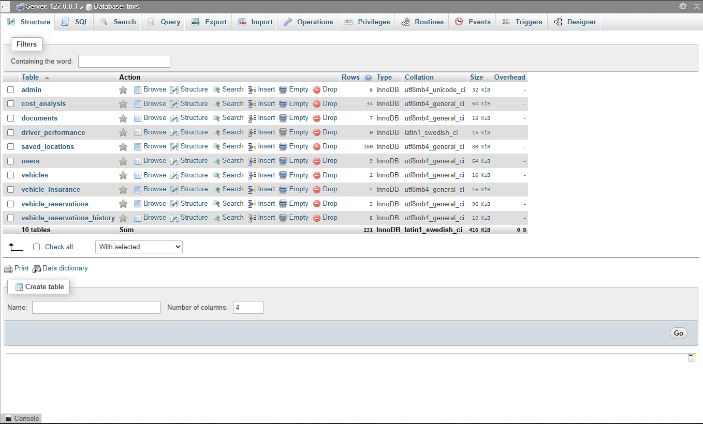

# Logistics 2 – TNVS Subsystem (Project Management)

**Logistics 2** in Project Management is a subsystem of a **TNVS (Transport Network Vehicle Service)** project developed for our Project Management course.  
This project integrates both **web and mobile applications**, developed in a **localhost environment**.  
It represents a significant milestone in my system development journey.

---

THE LANDING PAGE OF THE SYSTEM

-1.png>)
---
SIGN IN & REGISTRATION

**Registration Page**  

---

## Reservation Page

This section contains the core functionality of the system.

### Geo-Location Map

A functional geo-location feature allows users to search for a place, which then automatically appears in the search bar.

**Pick-Up Location**  

**Error Handling (Duplicate Pick-Up)**  

**Drop-Off Location**  

---

## Vehicle Selection

Vehicle selection is automatically determined based on the availability and registered vehicle type (Sedan, SUV, Hatchback, MPV, Van).

**Selected Vehicle (Sedan)**  

**No Available SUV**  

**No Available Sedan (Prevents Double Booking)**  

---

## Schedule Selection

---

## Additional Information

This section automatically displays the name of the currently logged-in user and includes a **trip description** field to prevent unnecessary inputs.

---

## Transport Cost Analysis

The transport cost is automatically calculated based on the **distance (in kilometers)** between the pick-up and drop-off locations.

---

## Reservation Cancellation

Users can cancel their reservation as long as it has not been dispatched yet.

---

## Completed Reservation

When the user reaches their destination, the system displays a **Completed Reservation** summary similar to e-commerce order confirmations.

---

## Travel History

Displays the travel history of the currently logged-in user.

### Driver Rating

Users can rate their driver after completing a trip.

---

## Become a Driver

Users can register to become drivers through this section.

  
  

---

## Admin Panel

The **Admin Side** provides system management and monitoring tools.

### Dashboard  

### Reservation and Dispatch  

### Travel Records  

### Users  

### Drivers  

---

## Mobile Version (Driver Side)

This section showcases the **mobile interface** designed specifically for drivers.  
It includes key features such as the driver dashboard, assigned customer view, trip route with live geolocation, and trip history.

---

### Driver Dashboard
Displays actived assigned trips and total earned(based on trip the driver trip cost)

---

### Assigned Customer
Shows the passenger assigned to the driver, including pickup and destination details.

---

### Trip Route
Provides a live route display powered by a built-in API using **latitude and longitude geolocation** for accurate tracking.  
This feature was one of the most technically challenging parts of the project.

---

### Trip History
Displays all completed trips associated with the logged-in driver for record-keeping and review.

---
## Database

This system uses a **MySQL database** hosted on **XAMPP (localhost)** for managing all core data.  
It stores information such as user accounts, driver details, reservations, trip routes, and travel history.  
The database is structured for efficiency, ensuring reliable data handling between the **web** and **mobile** applications.

---
## Conclusion

The development of this system provided valuable hands-on experience in **full-stack web and mobile application development** using modern tools such as **node.js**, and **MySQL (XAMPP)**.  
Through this project, I learned how to design, integrate, and manage various components—from frontend interfaces to backend services and database connectivity—while maintaining functionality within a localhost environment.  

Building the Logistics 2 subsystem for the TNVS project strengthened my understanding of **system architecture, user interaction flow, and data management**.  
It also enhanced my problem-solving skills, particularly in implementing real-time features such as **geo-location routing** and **automated trip assignments**.  

Overall, this project marks a significant milestone in my learning journey as it reflects both the **technical knowledge** and **project management skills** essential for developing scalable, reliable systems in real-world scenarios.
---
**Developed by:** Ken Española 
**Year:** 2025
